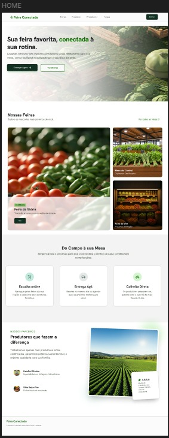
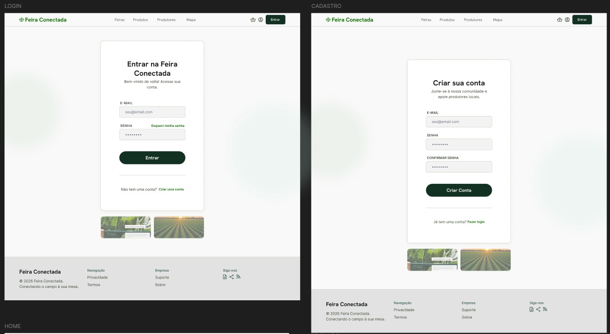
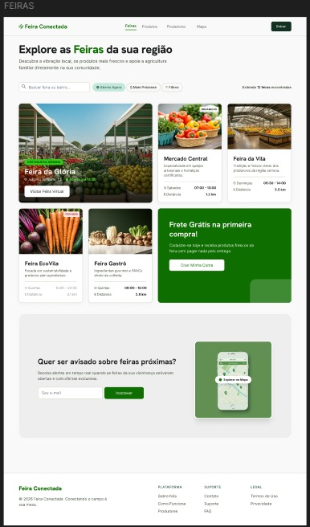
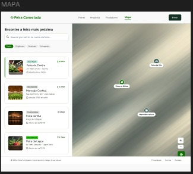
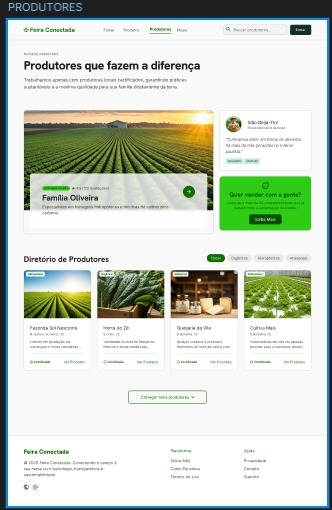
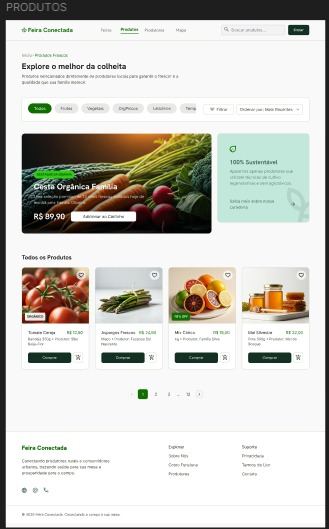
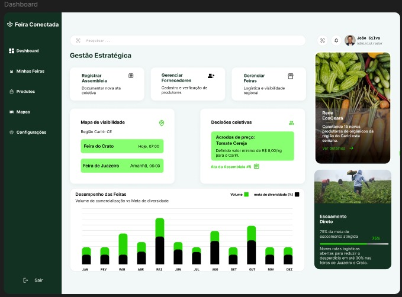
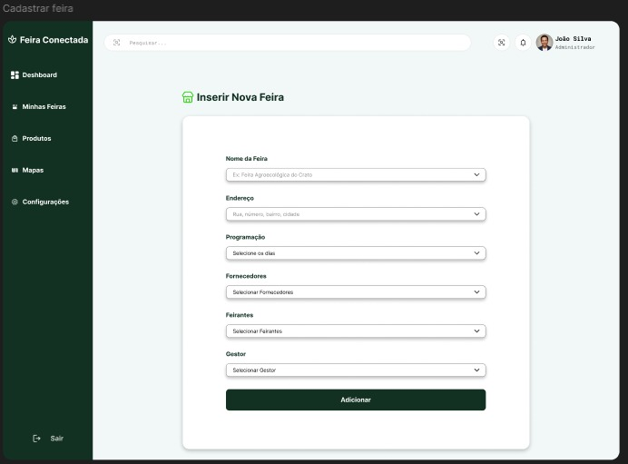
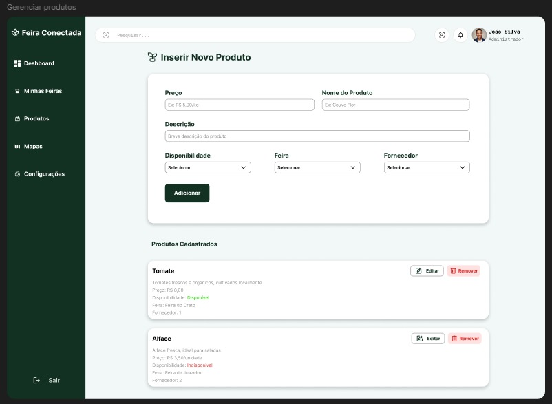

# 🎯 Projeto Integrado III - Feira Conectada

Universidade Federal do Cariri (UFCA)  
Análise e Desenvolvimento de Sistemas (ADS)  
Disciplina: Projeto Integrado III [ADS0038]  
Professor: Prof. Luís Fabrício de Freitas Souza

---

## 🔗 Continuidade do Projeto

Este repositório é a continuidade do projeto de referência desenvolvido no repositório [projeto-integrado-ii-wireframe-sitemap](https://github.com/weberfern/projeto-integrado-ii-wireframe-sitemap). Aqui, o trabalho evolui do wireframe e do sitemap para o protótipo de alta fidelidade do MVP, mantendo a mesma base conceitual e ampliando a documentação visual.

---

## 👥 Equipe

| Nome | Matrícula |
| --- | --- |
| Iago Ronan Almino Oliveira | 2025012453 |
| Jefferson Rodrigues de Oliveira | 2025013432 |
| Lucas Gabriel Correia Gonçalves | 2025013479 |
| Luiz Filipy Soares da Silva | 2025013503 |
| Marcelo dos Santos Alves | 2023010825 |
| Weber Fernandes da Silva | 2025019356 |

---

## 🌐 Visão Geral

O projeto Feira Conectada tem como proposta apoiar a organização, divulgação e acesso às informações de uma feira conectada em ambiente web. Este entregável parcial apresenta o protótipo de alta fidelidade do MVP, desenvolvido no Figma, com foco nas principais telas e fluxos da aplicação.

---

## 🧩 Problema que a solução resolve

Feiras e iniciativas semelhantes costumam depender de processos pouco centralizados para organizar informações, apresentar conteúdo ao público e facilitar a navegação entre as principais áreas do sistema. Isso pode gerar confusão, demora no acesso às informações e uma experiência pouco consistente para os usuários.

O Feira Conectada busca reduzir esse problema com uma interface clara, organizada e acessível, centralizando a experiência em um único ambiente digital.

---

## 🎯 Objetivo do Sistema

O objetivo do sistema é oferecer uma experiência web simples e intuitiva para apresentar o projeto da feira, apoiar a navegação entre suas principais funcionalidades e servir como base para a evolução incremental do MVP.

Neste EP1, o foco está na construção do protótipo de alta fidelidade, validando a proposta visual e a estrutura de interação antes da implementação final.

---

## ⚙️ Como o Sistema Funciona

Em visão geral, o sistema organiza a apresentação da solução em blocos de informação e em telas com fluxo coerente de navegação. O usuário deve conseguir:

- entender rapidamente o propósito da plataforma;
- acessar as seções principais com poucos cliques;
- visualizar conteúdos e informações relevantes de forma organizada;
- reconhecer padrões visuais consistentes durante toda a navegação.

O protótipo foi pensado para demonstrar esse fluxo de forma fiel ao produto desejado, usando componentes, hierarquia visual e padrões de interação que aproximam a experiência do resultado final.

---

## 🛠️ Tecnologias Utilizadas

Para o EP1, as tecnologias e recursos utilizados foram:

- Figma, para criação do protótipo de alta fidelidade;
- Componentes reutilizáveis e auto layout, para manter consistência visual;
- Princípios de UI e UX, para orientar a organização da interface;
- Estrutura de documentação em Markdown, para registrar o projeto no GitHub.

---

## ▶️ Como Executar ou Utilizar a Aplicação

Este entregável é um protótipo no Figma, portanto será por meio da navegação do protótipo.

Para utilizar o material:

1. Acesse o link do Figma na seção correspondente abaixo.
2. Navegue pelas telas do protótipo.
3. Observe os fluxos principais, a organização dos componentes e as decisões visuais.
4. Se necessário, consulte as imagens incluídas neste README para referência rápida das telas.

---

## 🔗 Link do Figma

[Acessar o protótipo no Figma](https://www.figma.com/proto/Y6Gp707VJ8QontEII1u2kv/Projeto-Integrado-III---Sprint-1---Feira-Conectada?node-id=2045-47&t=4iMK7GwI5DYnqT3e-1&scaling=min-zoom&content-scaling=fixed&page-id=0%3A1&starting-point-node-id=2145%3A148)

---

## 🖼️ Protótipo de Alta Fidelidade

O MVP foi dividido em duas experiências principais: telas para visitantes, sem login ou cadastro, e telas para usuário logado, com acesso à área administrativa. As interfaces mudam de acordo com o perfil de uso, mas mantêm consistência visual, hierarquia clara e identidade do projeto.

### 👤 Telas para visitantes (usuário não cadastrados/logados)

#### Tela inicial

Mostra a primeira impressão do sistema, com apresentação da proposta da Feira Conectada, destaque para feiras, produtos e produtores, e acesso rápido às principais áreas públicas.

#### Login e cadastro

Apresenta as telas de autenticação, permitindo que o visitante entre na plataforma ou crie uma nova conta para acessar a área logada.

#### Feiras 

Exibe o catálogo de feiras com busca, filtros e cards informativos para facilitar a descoberta de opções próximas.

#### Mapa de feiras 

Apresenta as feiras em um mapa com pontos de referência e lista lateral, reforçando a navegação por localização.

#### Produtores 

Mostra produtores em destaque e um diretório com cards, reforçando a conexão entre origem dos produtos e a feira.

#### Produtos 

Organiza o catálogo de produtos com categorias, vitrines e paginação, permitindo explorar os itens de forma visual e direta.

### 🔒 Telas para usuário logado

#### Dashboard administrativo

Concentra os indicadores estratégicos do sistema, com gráficos, cards e informações de gestão para apoiar decisões administrativas.

#### Gerenciar feiras

Permite cadastrar uma nova feira por meio de formulário com campos estruturados para organizar dados essenciais da operação.

#### Gerenciar produtos

Permite cadastrar e manter produtos, além de listar os itens já registrados com ações de edição e remoção.

---

## 🧭 Decisões Tomadas ao Longo do Desenvolvimento

Algumas decisões importantes orientaram a construção do protótipo:

- priorizar uma navegação simples, com menos distrações e mais clareza;
- manter consistência de cores, tipografia e espaçamento em todas as telas;
- destacar as informações mais importantes em primeiro plano;
- organizar a interface para facilitar leitura rápida e entendimento do fluxo;
- criar uma base visual que permita evolução gradual nas próximas entregas.

Essas decisões ajudam a transformar o protótipo em uma representação mais próxima do uso real do sistema e tornam a experiência mais previsível para o usuário.

---

## 💡 Importância da Experiência do Usuário (UX)

Um bom design de interface impacta diretamente a forma como as pessoas entendem, usam e confiam em um sistema. Quando uma aplicação é clara, visualmente organizada e fácil de navegar, o usuário encontra o que precisa com menos esforço, comete menos erros e se sente mais seguro para continuar usando a plataforma.

Na prática, isso faz diferença porque sistemas bem projetados tendem a ser mais aceitos no mundo real. Eles reduzem barreiras de aprendizado, aumentam a satisfação e facilitam o acesso de pessoas com perfis diferentes, inclusive aquelas que não têm familiaridade com tecnologia. Por isso, a experiência do usuário não é apenas um detalhe estético: ela influencia diretamente a utilidade, a adoção e o sucesso de uma solução digital.

No Feira Conectada, a preocupação com UX orientou escolhas como organização visual, legibilidade, padronização dos elementos e clareza nos fluxos. O objetivo é que a interface seja compreendida com rapidez e que o protótipo já transmita uma sensação de produto maduro e confiável.

---